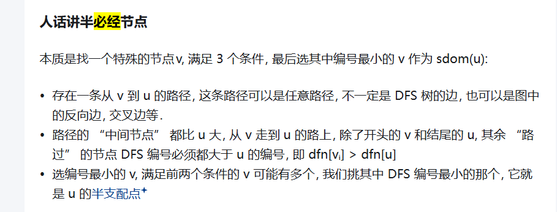

## 前言
更激进的死代码删除.

## 正文
在 `llvm/lib/Transforms/Scalar/ADCE.cpp`:
```cpp
PreservedAnalyses ADCEPass::run(Function &F, FunctionAnalysisManager &FAM) {
  // ADCE does not need DominatorTree, but require DominatorTree here
  // to update analysis if it is already available.
  auto *DT = FAM.getCachedResult<DominatorTreeAnalysis>(F);
  auto &PDT = FAM.getResult<PostDominatorTreeAnalysis>(F);
  ADCEChanged Changed =
      AggressiveDeadCodeElimination(F, DT, PDT).performDeadCodeElimination();
  if (!Changed.ChangedAnything)
    return PreservedAnalyses::all();

  PreservedAnalyses PA;
  if (!Changed.ChangedControlFlow) {
    PA.preserveSet<CFGAnalyses>();
    if (!Changed.ChangedNonDebugInstr) {
      // Only removing debug instructions does not affect MemorySSA.
      //
      // Therefore we preserve MemorySSA when only removing debug instructions
      // since otherwise later passes may behave differently which then makes
      // the presence of debug info affect code generation.
      PA.preserve<MemorySSAAnalysis>();
    }
  }
  PA.preserve<DominatorTreeAnalysis>();
  PA.preserve<PostDominatorTreeAnalysis>();

  return PA;
}
```
其中 `auto *DT = FAM.getCachedResult<DominatorTreeAnalysis>(F);` 是支配树, `auto &PDT = FAM.getResult<PostDominatorTreeAnalysis>(F);` 是后支配树. ADCEPass 的核心实现就是 `AggressiveDeadCodeElimination(F, DT, PDT).performDeadCodeElimination();`. 在看 `AggressiveDeadCodeElimination` 类之前, 让我们简单回忆一下必经节点, 后必经节点, 支配, 支配树, 后支配树等概念:
- 想象一个 cfg: 有很多基本块(包括基本块 A 与 B), 有各种语句.
- 支配节点与支配: A 支配 B = 从入口走到 B, 必须经过 A, 则 A 是 B 的支配节点. 每个块支配自己.
- 严格支配: A 支配 B, A ≠ B, A 严格支配 B.
- 必经节点: 离 B 最近的支配节点是必经节点. 则每个节点只有一个必经节点.
- 支配树: 将所有的直接支配关系链接起来就是一棵树(由 "每个节点只有一个必经节点" 可以推是树不是环). 树上从根到任何节点的路径 = 支配链.
- 后支配节点: A 后支配 B = 从 B 走到函数出口, 必须经过 A. 每个块后支配自己.
- 后必经节点: 离 B 最近的后支配节点是后必经节点, 则每个节点只有一个后必经节点.
- 后支配树: 把所有直接后支配关系连起来, 也是一棵树
- 支配边界: A 支配 B 的某个前驱块, A 不严格支配 B, B 是 A 的支配边界. 也就是说 `A 能管住一条到 B 的路, 但管不住所有到 B 的路, 那么 B 是 A 的支配边界`. (phi 节点所在块, 必须是「不同分支中变量定义块」的支配边界, 这个后续 SSA 再谈)
- 后支配边界: 支配边界定义反过来, B 被 A 的某个后继块后支配, B 不被 A 严格后支配, B 是 A 的后支配边界. 也就是说 `A 有多条路走向出口, 其中一部分路会经过 B, 另一部分不经过 B, 那么 B 就是 A 的后支配边界`.
- 迭代支配边界: DF 的迭代 = 把所有间接能影响到的块全都算进去, 即 `IDF(X) = DF(X) ∪ DF(DF(X)) ∪ DF(DF(DF(X)))...`
- 半支配节点: 只用于高效算支配树, 是个工具节点, Lengauer-Tarjan 算法.
  

我们先看这两个储存指令和基本块信息的结构体:
```cpp
/// 指令级别的存活状态信息
struct InstInfoType {
  /// 是否需要保留
  bool Live = false;

  /// 指向该指令所属基本块的 BlockInfoType
  struct BlockInfoType *Block = nullptr;
};

/// 基本块级别的存活状态信息
struct BlockInfoType {
  /// 是否需要保留
  bool Live = false;

  /// 该块的终止指令是「无条件分支」, 比如 br label %x, 没有 if 判断
  bool UnconditionalBranch = false;

  /// 该块内有"活的"PHI节点
  bool HasLivePhiNodes = false;

  /// 控制依赖存活标记, 如果块 A 的执行依赖块B的分支结果 → B 是 A 的控制依赖源, 这样如果 A 是活的, 那么 B 就是控制依赖存活
  bool CFLive = false;

  /// 指向该块终止指令的 InstInfoType
  InstInfoType *TerminatorLiveInfo = nullptr;

  /// 关联到实际的基本块对象
  BasicBlock *BB = nullptr;

  /// 缓存该块的终止指令, 基本块的终止指令也就是跳转什么的.
  Instruction *Terminator = nullptr;

  /// 反向控制流图的后序编号, 编号越大越接近函数出口
  unsigned PostOrder;

  bool terminatorIsLive() const { return TerminatorLiveInfo->Live; }
};
```

回到 `AggressiveDeadCodeElimination`:
```cpp
AggressiveDeadCodeElimination(Function &F, DominatorTree *DT,
                              PostDominatorTree &PDT)
    : F(F), DT(DT), PDT(PDT) {}

ADCEChanged AggressiveDeadCodeElimination::performDeadCodeElimination() {
  initialize();
  markLiveInstructions();
  return removeDeadInstructions();
}
```
我们跟着 `performDeadCodeElimination` 中的调用看一看, 首先是 `initialize`:
```cpp
/*
MapVector<BasicBlock *, BlockInfoType> BlockInfo;
DenseMap<Instruction *, InstInfoType> InstInfo;
*/

void AggressiveDeadCodeElimination::initialize() {
  auto NumBlocks = F.size();

  // 预分配 BlockInfo 的空间
  BlockInfo.reserve(NumBlocks);
  size_t NumInsts = 0;

  // 遍历所有基本块, 初始化每个块的 BlockInfo, 并统计总指令数
  for (auto &BB : F) {
    NumInsts += BB.size();                // 累加当前块的指令数
    auto &Info = BlockInfo[&BB];
    Info.BB = &BB;                        // 指向实际的基本块
    Info.Terminator = BB.getTerminator(); // 记录块的终止指令
    Info.UnconditionalBranch = isUnconditionalBranch(Info.Terminator);  // 判断该块是否以「无条件分支」结尾
  }

  // 初始化指令的 InstInfo
  InstInfo.reserve(NumInsts);
  for (auto &BBInfo : BlockInfo)
    for (Instruction &I : *BBInfo.second.BB)
      InstInfo[&I].Block = &BBInfo.second;    // 指向对应的 BlockInfoType

  // 让块的 TerminatorLiveInfo 指向其终止指令的 InstInfo
  for (auto &BBInfo : BlockInfo)
    BBInfo.second.TerminatorLiveInfo = &InstInfo[BBInfo.second.Terminator];

  // 标记「根活指令」, 这是一些一定不能删的指令, 由 isAlwaysLive 判断
  for (Instruction &I : instructions(F))
    if (isAlwaysLive(I))
      markLive(&I);

  if (!RemoveControlFlowFlag)
    return;

  if (!RemoveLoops) {
    // 定义状态映射: 记录基本块是否被访问过, 以及是否在 DFS 的栈上, 用于判断回边
    using StatusMap = DenseMap<BasicBlock *, bool>;

    class DFState : public StatusMap {
    public:
      std::pair<StatusMap::iterator, bool> insert(BasicBlock *BB) {
        return StatusMap::insert(std::make_pair(BB, true));
      }

      // 迭代器会在遍历完某个块后调用 completed, 这样回溯时就标记成false, 在栈中是标记成true, 判断回边
      void completed(BasicBlock *BB) { (*this)[BB] = false; }

      bool onStack(BasicBlock *BB) {
        auto Iter = find(BB);
        return Iter != end() && Iter->second;
      }
    } State;

    State.reserve(F.size());

    // 深度优先遍历所有基本快, 如果当前块的后继块在DFS栈上 → 这是循环回边 → 标记当前块的终止指令为活
    for (auto *BB: depth_first_ext(&F.getEntryBlock(), State)) {
      Instruction *Term = BB->getTerminator();
      if (isLive(Term))
        continue;

      for (auto *Succ : successors(BB))
        if (State.onStack(Succ)) {
          // 回边
          markLive(Term);
          break;
        }
    }
  }

  // 处理无限循环 / 无法到达 return 的块
  // PDT.getRootNode() 是一个虚拟的 exit 块, 遍历后支配树根节点的所有直接子节点, 也是真是结束块, 结束块可能有多个, 因为一个函数可能有多个返回
  for (const auto &PDTChild : children<DomTreeNode *>(PDT.getRootNode())) {
    auto *BB = PDTChild->getBlock();
    auto &Info = BlockInfo[BB];
    // 如果这个块是真正的 return 块 → 跳过, 不用标记
    if (isa<ReturnInst>(Info.Terminator)) {
      LLVM_DEBUG(dbgs() << "post-dom root child is a return: " << BB->getName()
                        << '\n';);
      continue;
    }

    // 这个块不是 return 块 → 说明它是无法到达 return 的块, 如无限循环, 遍历这个后支配子树的所有节点, 把这些块的终止指令都标记为活的
    for (auto *DFNode : depth_first(PDTChild))
      markLive(BlockInfo[DFNode->getBlock()].Terminator);
  }

  // 标记入口块为活
  auto *BB = &F.getEntryBlock();
  auto &EntryInfo = BlockInfo[BB];
  EntryInfo.Live = true;
  if (EntryInfo.UnconditionalBranch)
    markLive(EntryInfo.Terminator);

  // 遍历所有基本块信息, 收集所有终止指令为死的块
  for (auto &BBInfo : BlockInfo)
    if (!BBInfo.second.terminatorIsLive())
      BlocksWithDeadTerminators.insert(BBInfo.second.BB);
}
```
瞄一眼
```cpp
bool Instruction::mayHaveSideEffects() const {
  return mayWriteToMemory() || mayThrow() || !willReturn();
}

bool AggressiveDeadCodeElimination::isAlwaysLive(Instruction &I) {
  // 异常处理相关指令, 有副作用的指令标记为必须活
  if (I.isEHPad() || I.mayHaveSideEffects()) {
    // 如果是「对常量做值分析的插桩指令」→ 无实际副作用, 标记为非必须存活
    if (isInstrumentsConstant(I))
      return false;
    return true;
  }

  // 非终止指令 → 不是必须存活
  if (!I.isTerminator())
    return false;
  // 如果开启了「删除控制流」开关 → 分支/开关指令不是必须存活
  if (RemoveControlFlowFlag && (isa<BranchInst>(I) || isa<SwitchInst>(I)))
    return false;
  return true;
}
```
再看看 `markLive`:
```cpp
void AggresiveDeadCodeElimination::markLive(Instruction *I) {
  auto &Info = InstInfo[I];
  if (Info.Live)
    return;

  LLVM_DEBUG(dbgs() << "mark live: "; I->dump());

  // 将指令标记为存活
  Info.Live = true;
  // 将该指令加入工作队列, 下面会用
  Worklist.push_back(I);

  // 保留存活代码的调试信息
  if (const DILocation *DL = I->getDebugLoc())
    collectLiveScopes(*DL);
  
  // 获取该指令所属基本块的元信息
  auto &BBInfo = *Info.Block;
  // 如果当前指令是基本块的终止指
  if (BBInfo.Terminator == I) {
    // 该基本块的终止指令已存活, 因此从"死终止指令块集合"中移除
    BlocksWithDeadTerminators.remove(BBInfo.BB);
    // 对于条件分支的终止指令, 标记其所有后继基本块为存活
    if (!BBInfo.UnconditionalBranch)
      for (auto *BB : successors(I->getParent()))
        markLive(BB);
  }
  // 进入下面的重载
  markLive(BBInfo);
}

void AggressiveDeadCodeElimination::markLive(BlockInfoType &BBInfo) {
  if (BBInfo.Live)
    return;
  LLVM_DEBUG(dbgs() << "mark block live: " << BBInfo.BB->getName() << '\n');
  // 将基本块标记为存活
  BBInfo.Live = true;
  if (!BBInfo.CFLive) {
    BBInfo.CFLive = true;
    // 首次标记时加入 NewLiveBlocks 集合
    NewLiveBlocks.insert(BBInfo.BB);
  }

  // 无条件分支标记其为存活, 无条件分支的存活不影响控制流选择, 直接标记即可
  if (BBInfo.UnconditionalBranch)
    markLive(BBInfo.Terminator);
}
```
可以看到 `markLive` 还是做了很多的, 两个重载对指令和块处理:
- 维护 Worklist 等, 方便后续处理
- 收集调试信息
- 以条件分支指令为终止指令的基本块, 将其及其后继标记为活
- 无条件分支标记其为活

在来看 `markLiveInstructions`:
```cpp
void AggressiveDeadCodeElimination::markLiveInstructions() {
  do {
    while (!Worklist.empty()) {
      // 弹出工作队列最后一个元素
      Instruction *LiveInst = Worklist.pop_back_val();
      LLVM_DEBUG(dbgs() << "work live: "; LiveInst->dump(););

      // 遍历该存活指令的所有操作数
      for (Use &OI : LiveInst->operands())
        // 仅标记操作数是指令的为活
        if (Instruction *Inst = dyn_cast<Instruction>(OI))
          markLive(Inst);

      // 特殊处理 PHI 节点
      if (auto *PN = dyn_cast<PHINode>(LiveInst))
        markPhiLive(PN);
    }

    // 计算存活块的控制依赖源, 标记这些分支指令为存活
    markLiveBranchesFromControlDependences();

  } while (!Worklist.empty());
}

void AggressiveDeadCodeElimination::markPhiLive(PHINode *PN) {
  auto &Info = BlockInfo[PN->getParent()];
  // 每个基本块只需处理一次"有存活PHI节点"的逻辑, 避免重复处理
  if (Info.HasLivePhiNodes)
    return;
  Info.HasLivePhiNodes = true;

  // 遍历 PHI 节点所属块的所有前驱基本块
  for (auto *PredBB : predecessors(Info.BB)) {
    auto &Info = BlockInfo[PredBB];
    if (!Info.CFLive) {
      // 标记前驱块为控制依赖存活
      Info.CFLive = true;
      // 加入 NewLiveBlocks
      NewLiveBlocks.insert(PredBB);
    }
  }
}

void AggressiveDeadCodeElimination::markLiveBranchesFromControlDependences() {
  if (BlocksWithDeadTerminators.empty())
    return;

  LLVM_DEBUG({
    dbgs() << "new live blocks:\n";
    for (auto *BB : NewLiveBlocks)
      dbgs() << "\t" << BB->getName() << '\n';
    dbgs() << "dead terminator blocks:\n";
    for (auto *BB : BlocksWithDeadTerminators)
      dbgs() << "\t" << BB->getName() << '\n';
  });

  // BlocksWithDeadTerminators 中存储了终止指令为死的块, 即候选的控制依赖源
  const SmallPtrSet<BasicBlock *, 16> BWDT(llvm::from_range,
                                           BlocksWithDeadTerminators);
  SmallVector<BasicBlock *, 32> IDFBlocks;
  // 基于后支配树(PDT)计算反向控制流图的迭代后支配边界
  ReverseIDFCalculator IDFs(PDT);
  IDFs.setDefiningBlocks(NewLiveBlocks);  // 需要分析控制依赖的存活块集合
  IDFs.setLiveInBlocks(BWDT);
  IDFs.calculate(IDFBlocks);
  NewLiveBlocks.clear();                  // 计算迭代后支配边界, 结果存入 IDFBlocks

  // 将这些后支配边界节点标记为活, 块的分支决策直接决定存活块是否能被执行
  for (auto *BB : IDFBlocks) {
    LLVM_DEBUG(dbgs() << "live control in: " << BB->getName() << '\n');
    markLive(BB->getTerminator());
  }
}
```
- 从 `Worklist` 中的存活指令出发, 标记其所有操作数为存活, 如果指令A=B+C是活的 → 必须把B、C的定义指令也标活
- 处理 PHI 指令
- 分析控制依赖, 将存活块的后支配边界标记为活.

在来看看 `removeDeadInstructions`:
```cpp
ADCEChanged AggressiveDeadCodeElimination::removeDeadInstructions() {
  ADCEChanged Changed;
  // 修复死控制流
  Changed.ChangedControlFlow = updateDeadRegions();

  // 仅 DEBUG 模式, 检查死调试指令
  LLVM_DEBUG({
    for (Instruction &I : instructions(F)) {
      if (isLive(&I))
        continue;

      if (auto *DII = dyn_cast<DbgVariableIntrinsic>(&I)) {
        if (AliveScopes.count(DII->getDebugLoc()->getScope()))
          continue;

        for (Value *V : DII->location_ops()) {
          if (Instruction *II = dyn_cast<Instruction>(V)) {
            if (isLive(II)) {
              dbgs() << "Dropping debug info for " << *DII << "\n";
              break;
            }
          }
        }
      }
    }
  });

  // 从后往前 → 先删"使用者"再删"被使用者", 避免悬空引用
  for (Instruction &I : llvm::reverse(instructions(F))) {
    // 保留活作用域的调试信息
    for (DbgRecord &DR : make_early_inc_range(I.getDbgRecordRange())) {
      if (DbgVariableRecord *DVR = dyn_cast<DbgVariableRecord>(&DR);
          DVR && DVR->isDbgAssign())
        if (!at::getAssignmentInsts(DVR).empty())
          continue;
      if (AliveScopes.count(DR.getDebugLoc()->getScope()))
        continue;
      I.dropOneDbgRecord(&DR);
    }

    if (isLive(&I))
      continue;

    Changed.ChangedNonDebugInstr = true;  // 修改了非调试指令

    // 这里 Worklist 是空的, 上边 markLiveInstructions 确保了这点
    // 将死指令加入待删队列, 抢救调试信息, 准备删除
    Worklist.push_back(&I);
    salvageDebugInfo(I);
  }

  // 解除待删指令的所有引用
  for (Instruction *&I : Worklist)
    I->dropAllReferences();

  // 删除指令
  for (Instruction *&I : Worklist) {
    ++NumRemoved;
    I->eraseFromParent();
  }

  // 修改了任意内容标记
  Changed.ChangedAnything = Changed.ChangedControlFlow || !Worklist.empty();

  return Changed;
}

bool AggressiveDeadCodeElimination::updateDeadRegions() {
  LLVM_DEBUG({
    dbgs() << "final dead terminator blocks: " << '\n';
    for (auto *BB : BlocksWithDeadTerminators)
      dbgs() << '\t' << BB->getName()
             << (BlockInfo[BB].Live ? " LIVE\n" : "\n");
  });

  bool HavePostOrder = false;
  bool Changed = false;
  SmallVector<DominatorTree::UpdateType, 10> DeletedEdges;

  // 遍历所有「终止指令为死」的块
  for (auto *BB : BlocksWithDeadTerminators) {
    auto &Info = BlockInfo[BB];

    // 无条件分支块 → 强制标记终止指令为活
    if (Info.UnconditionalBranch) {
      InstInfo[Info.Terminator].Live = true;
      continue;
    }

    // 以下处理条件分支块

    // 首次进入到达 → 计算反向后序编号
    if (!HavePostOrder) {
      computeReversePostOrder();
      HavePostOrder = true;
    }

    // 为死分支块选择「最优后继块」: 反向后序编号最大的后继, 最接近函数出口, 保证控流能到 exit
    BlockInfoType *PreferredSucc = nullptr;
    for (auto *Succ : successors(BB)) {
      auto *Info = &BlockInfo[Succ];
      // 选编号更大的后继
      if (!PreferredSucc || PreferredSucc->PostOrder < Info->PostOrder)
        PreferredSucc = Info;
    }
    assert((PreferredSucc && PreferredSucc->PostOrder > 0) &&
           "Failed to find safe successor for dead branch");

    // 删除非最优后继的 CFG 边, 修复前驱关系
    SmallPtrSet<BasicBlock *, 4> RemovedSuccessors;
    bool First = true;
    for (auto *Succ : successors(BB)) {
      // 保留「第一个出现的最优后继」, 删除其他所有后继-前驱关系边, 可能会有当前块多条边指向同一个后继, 所以要判断下 First
      if (!First || Succ != PreferredSucc->BB) {
        Succ->removePredecessor(BB);
        RemovedSuccessors.insert(Succ);
      } else
        First = false;
    }
    // 将条件分支指令替换为非条件分支指令
    makeUnconditional(BB, PreferredSucc->BB);

    // 记录删除的边
    for (auto *Succ : RemovedSuccessors) {
      if (Succ != PreferredSucc->BB) {
        LLVM_DEBUG(dbgs() << "ADCE: (Post)DomTree edge enqueued for deletion"
                          << BB->getName() << " -> " << Succ->getName()
                          << "\n");
        DeletedEdges.push_back({DominatorTree::Delete, BB, Succ});
      }
    }

    NumBranchesRemoved += 1;
    Changed = true;
  }

  // 更新支配树(DT)和后支配树(PDT)
  if (!DeletedEdges.empty())
    DomTreeUpdater(DT, &PDT, DomTreeUpdater::UpdateStrategy::Eager)
        .applyUpdates(DeletedEdges);

  return Changed;
}

void AggressiveDeadCodeElimination::computeReversePostOrder() {
  SmallPtrSet<BasicBlock*, 16> Visited;
  unsigned PostOrder = 0;

  // 遍历所有块, 找到无后继的块, 函数出口
  for (auto &BB : F) {
    if (!succ_empty(&BB))
      continue;
    // 反向后序遍历 CFG, 分配编号
    for (BasicBlock *Block : inverse_post_order_ext(&BB,Visited))
      BlockInfo[Block].PostOrder = PostOrder++;
  }
}
```
- `removeDeadInstructions` 方法就是 调用 `updateDeadRegions` 修复死块的控制流, 然后从后向前遍历每条指令, 借助之前记录的指令存活状态映射表, 找到死指令然后删去. 
- `updateDeadRegions` 方法先调用 `computeReversePostOrder` 为所有块进行编号, 然后删除一些 cfg 边: 无条件跳转块会被强制标记终止指令为活, 而条件跳转指令可能会有多个边, 依据 `computeReversePostOrder` 找一个最优的边保留并改写成非条件跳转指令, 其他边删除. 为了 cfg 完整性, 使得所有块都能到达 exit 块, 所以不会将所有边都删除.
- `computeReversePostOrder` 方法找到所有实际出口块, 然后反向后序遍历 CFG, 分配编号, 反向后序遍历就是先反转 cfg, 然后后序遍历(先遍历所有前驱, 再记录当前节点), 这样编号会按执行顺序递增, 越靠近出口越大

对比 DCEPass 与 ADCEPass  
- DCEPass 仅删除 `无使用 + 无副作用` 的指令
- ADCEPass 既删指令, 又删 / 修复控制流

使用一下:
```ir
define i32 @Test(i32 %A, i32 %B) {
BB1:
        br label %BB4

BB2:            ; No predecessors!
        %tmp = add i32 1, 2
        br label %BB3

BB3:            ; preds = %BB4, %BB2
        %ret = phi i32 [ %X, %BB4 ], [ %B, %BB2 ]               ; <i32> [#uses=1]
        ret i32 %ret

BB4:            ; preds = %BB1
        %X = phi i32 [ %A, %BB1 ]               ; <i32> [#uses=1]
        br label %BB3
}
```
```bash
./build/bin/opt -passes=adce -S /tmp/a.ll
```
```ir
; ModuleID = '/tmp/a.ll'
source_filename = "/tmp/a.ll"

define i32 @Test(i32 %A, i32 %B) {
BB1:
  br label %BB4

BB2:                                              ; No predecessors!
  br label %BB3

BB3:                                              ; preds = %BB4, %BB2
  %ret = phi i32 [ %X, %BB4 ], [ %B, %BB2 ]
  ret i32 %ret

BB4:                                              ; preds = %BB1
  %X = phi i32 [ %A, %BB1 ]
  br label %BB3
}
```
可以看到 BB2 被正确处理了.