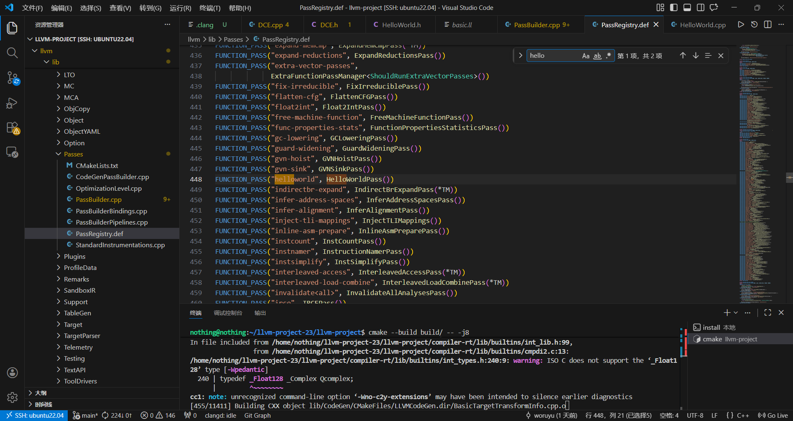

## 前言
这是一个最简单的 pass, 一个专门为初学者准备的案例(https://llvm.gnu.ac.cn/docs/WritingAnLLVMNewPMPass.html)

## 正文
代码非常少, 全都贴出来了, 简单说一说再试一试.

`llvm/include/llvm/Transforms/Utils/HelloWorld.h`:
```cpp
#ifndef LLVM_TRANSFORMS_UTILS_HELLOWORLD_H
#define LLVM_TRANSFORMS_UTILS_HELLOWORLD_H

#include "llvm/IR/PassManager.h"

namespace llvm {

class HelloWorldPass : public PassInfoMixin<HelloWorldPass> {
public:
  PreservedAnalyses run(Function &F, FunctionAnalysisManager &AM);
};

} // namespace llvm

#endif // LLVM_TRANSFORMS_UTILS_HELLOWORLD_H
```
`llvm/lib/Transforms/Utils/HelloWorld.cpp`:
```cpp
#include "llvm/Transforms/Utils/HelloWorld.h"
#include "llvm/IR/Function.h"

using namespace llvm;

PreservedAnalyses HelloWorldPass::run(Function &F,
                                      FunctionAnalysisManager &AM) {
  errs() << F.getName() << "\n";
  return PreservedAnalyses::all();
}
```
`PassInfoMixin` 是新 PM 的核心基类, 供 Pass 的元信息等, 必须实现 run 方法, 该方法实际运行 Pass 逻辑, 这个方法中, `Function &F` 表示当前正在处理的函数, `FunctionAnalysisManager &AM` 是分析管理器, 可获取函数的分析结果(如 CFG, DominatorTree 等), `PreservedAnalyses` 表示在此 Pass 执行过后哪些 Pass 还生效, `return PreservedAnalyses::all();` 表示在此 Pass 之后, 所有分析过后所有 Pass 都有效, 因为这个 `HelloWorldPass` 只进行打印, 不修改就不对任何其他 Pass 产生影响.

实验一下:

随便写一点 ir, `/tmp/a.ll`:
```ir
define i32 @foo() {
  %a = add i32 2, 3
  ret i32 %a
}

define void @bar() {
  ret void
}

define i32 @main() {
  ret i32 0
}
```
然后调用:
```bash
./build/bin/opt -disable-output /tmp/a.ll -passes=helloworld
```
得到结果:
```
foo
bar
main
```
所有静态注册的 pass 都可以这样使用, 在 `llvm/lib/Passes/PassRegistry.def` 文件中有静态注册的名称和对应类:

不过静态注册需要每次增量编译一下 opt:
```bash
ninja -C build/ opt
```